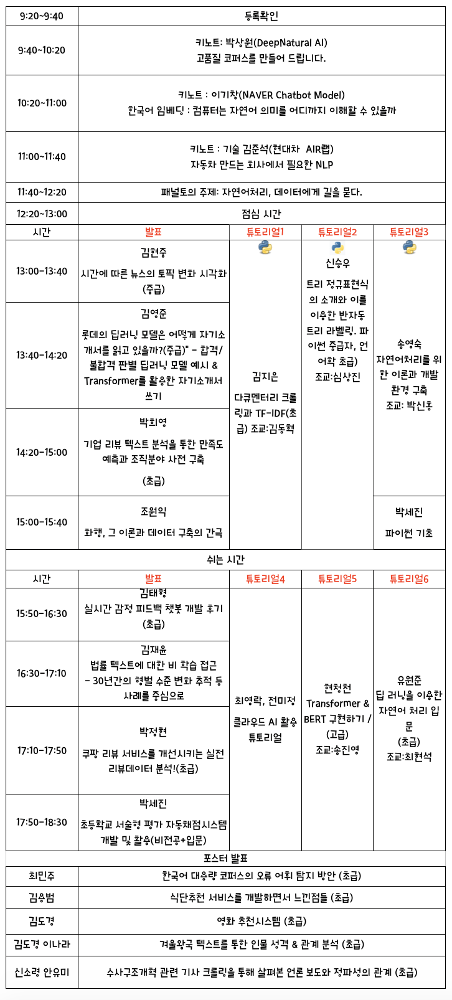

---
# Feel free to add content and custom Front Matter to this file.
# To modify the layout, see https://jekyllrb.com/docs/themes/#overriding-theme-defaults

layout: home
---

                  

 
 

      

#  2020/2/15(토)                             
                       
                            

# 찾아 오시는 길           
[서울특별시 종로구 중학동 19 더케이트윈타워 A동](http://naver.me/IMlGLw7y) 11층                            

# 지난 대회 보기          
[멜팅팡_연합세미나](https://www.onoffmix.com/event/110570)                   
[사람이 챗봇을 만듭니다!](https://www.onoffmix.com/event/124842)            
 >[발표 동영상](https://www.youtube.com/playlist?list=PLqkITFr6P-oRQu0OJCIqHuff-ubbCkWlL)  
 [Langcon2019](https://songys.github.io/2019LangCon/)                 

[봇봇봇](https://www.onoffmix.com/event/89407)          
[Langcon2019](https://songys.github.io/2019LangCon//)

# [오늘 행사에 대한 의견을 들려 주세요!]() 

# 후원                       

[Microsoft Learn](https://docs.microsoft.com/ko-kr/learn)            

[한림대학교 소프트웨어중심대학사업단](http://hlsw.hallym.ac.kr)                              
[한림대학교 디지털인문예술전공](https://sites.google.com/view/dah-hallym)            
 
                         
                
[위키북스](http://wikibook.co.kr/)                             
                         
                                        

